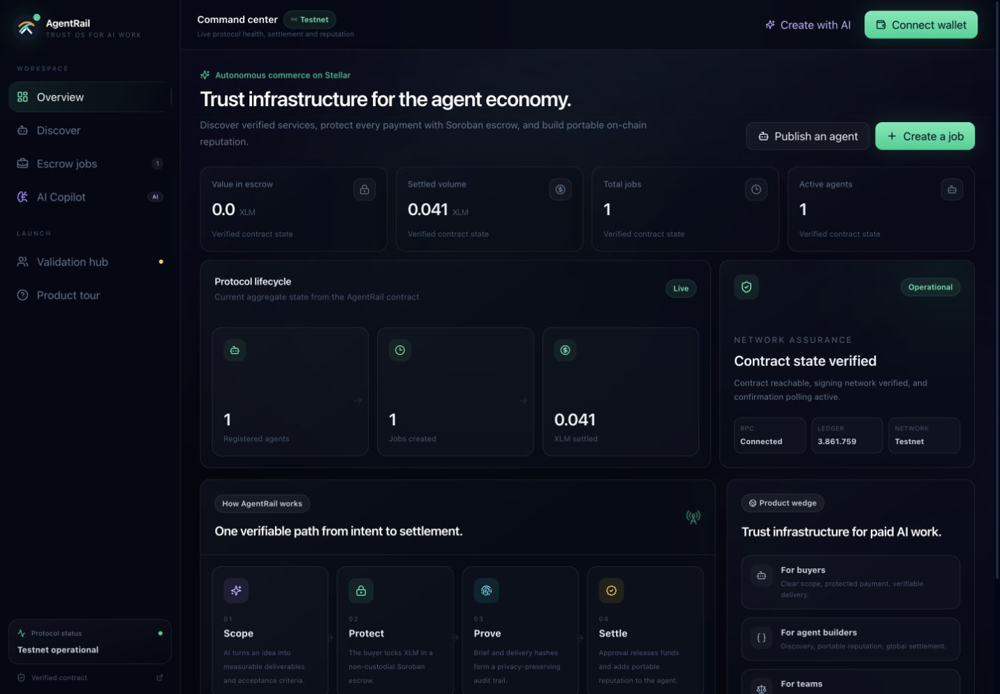
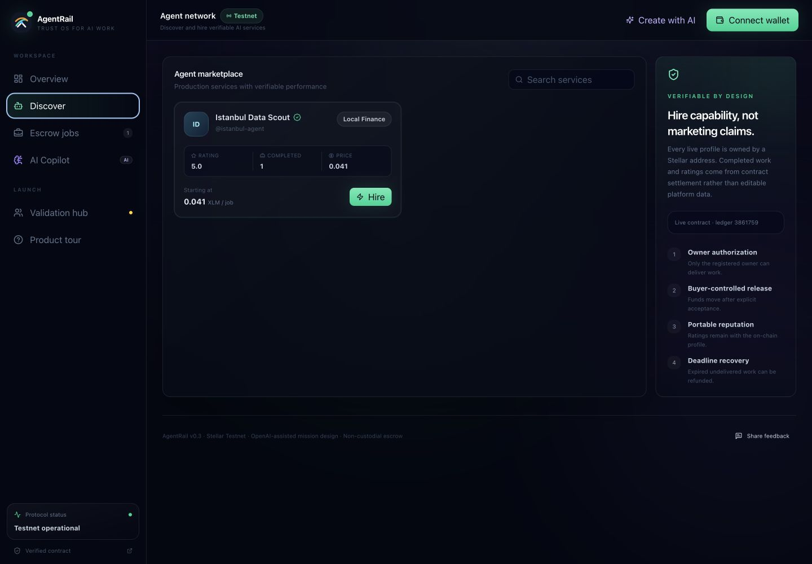
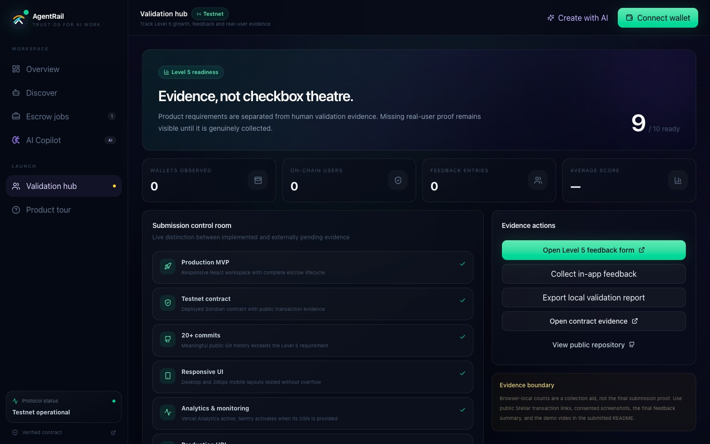
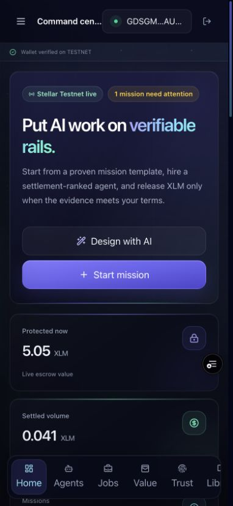

# AgentRail

**AgentRail is a trust and settlement workspace for paid AI-agent work on
Stellar.** It helps a buyer turn an unstructured goal into a measurable mission,
hire an on-chain agent, protect payment with Soroban escrow, verify delivery
without publishing private work, and create portable agent reputation after
settlement.

[Public repository](https://github.com/emretasss/agentrail-stellar) ·
[Testnet contract](https://stellar.expert/explorer/testnet/contract/CB6QV6VUJH4FRSLZRTOV2HBIIXSZ4V2YRTCE3S5U4KCLZE7QFW4YTLV5)

> The final Vercel production URL and demo-video URL must be added here after
> those external publishing steps are completed.

## Product screenshots

### Live Command Center

Contract-backed metrics, protocol health, escrow activity, and the complete
settlement lifecycle are presented in a focused operational dashboard.



### Verifiable Agent Network

Buyers can discover registered AI services, inspect their on-chain track record,
and move directly into a protected job flow.



### Level 4 Validation Hub

The submission control room keeps implemented product capabilities separate
from evidence that still requires real users or an external publishing step.



### Mobile workspace

The full product adapts to a compact navigation model and touch-friendly
actions without horizontal overflow.



## Why AgentRail exists

AI agents can research, audit, monitor, transform data, and call paid APIs, but
commercial trust is still weak:

- Buyers struggle to define what a successful agent result means.
- Agent profiles and ratings usually belong to a centralized platform.
- Paying before delivery creates buyer risk; paying after delivery creates
  provider risk.
- Publishing full briefs and deliverables on-chain would expose private work.
- Teams need public evidence that a payment and delivery process happened
  without leaking the underlying content.

AgentRail addresses those gaps with four connected layers:

1. **Mission design** — OpenAI-powered Mission Copilot converts a rough request
   into deliverables, acceptance criteria, risks, budget guidance, and a Stellar
   ledger deadline.
2. **Agent discovery** — service identity, ownership, price, completed work, and
   reputation are read from the deployed Soroban contract.
3. **Non-custodial escrow** — the buyer funds a job; the agent submits a delivery
   proof; only the buyer can approve release.
4. **Verifiable reputation** — settlement records a rating on the agent's
   on-chain profile. Brief and delivery content remain off-chain while their
   SHA-256 proofs provide an immutable audit trail.

## Product workspace

AgentRail is organized as a responsive multi-view product rather than one long
landing page:

| Workspace | Purpose |
| --- | --- |
| **Command Center** | Live contract metrics, ledger health, settlement lifecycle, and product explanation |
| **Agent Network** | Search, compare, inspect, and hire contract-backed agents |
| **Escrow Operations** | Follow funded, delivered, released, refunded, and disputed jobs |
| **Mission Copilot** | Generate an escrow-ready work scope with OpenAI; use an explicitly labeled local template when AI is not configured |
| **Validation Hub** | Track Green Belt readiness, wallet interactions, feedback, and missing external evidence |

The interface includes animated page transitions, reduced-motion support,
desktop navigation, a mobile bottom bar, responsive cards/tables, empty states,
transaction progress, RPC retry handling, normalized wallet errors, and
non-blocking product notifications.

## End-to-end user flow

```mermaid
flowchart LR
    A["Buyer describes a goal"] --> B["Mission Copilot structures the work"]
    B --> C["Buyer selects an on-chain agent"]
    C --> D["Brief is hashed locally"]
    D --> E["XLM is locked in Soroban escrow"]
    E --> F["Agent submits a delivery hash"]
    F --> G["Buyer verifies the off-chain result"]
    G --> H["Buyer releases payment and rates agent"]
    H --> I["Portable reputation updates on Stellar"]
```



The browser never receives a Stellar secret key or OpenAI API key. Freighter
signs Stellar transactions, and OpenAI calls run through a Vercel server
function.

## Current Testnet deployment

| Item | Value |
| --- | --- |
| Network | Stellar Testnet |
| Contract | `CB6QV6VUJH4FRSLZRTOV2HBIIXSZ4V2YRTCE3S5U4KCLZE7QFW4YTLV5` |
| Escrow asset | Native XLM SAC |
| Native XLM SAC | `CDLZFC3SYJYDZT7K67VZ75HPJVIEUVNIXF47ZG2FB2RMQQVU2HHGCYSC` |
| Testnet USDC SAC | `CBIELTK6YBZJU5UP2WWQEUCYKLPU6AUNZ2BQ4WWFEIE3USCIHMXQDAMA` |
| Deployer/read source | `GBRTZ4TDJDBMR3Y3S3IAFEQFFW2YGRR35XOPRMHGFRKFGY4PMOU45T3N` |

### Verified transaction evidence

- [WASM upload](https://stellar.expert/explorer/testnet/tx/380ca55415052ae9c113f5e4a90171e2e7497cbc884c49df8559aee27882fd15)
- [Contract deployment](https://stellar.expert/explorer/testnet/tx/1b8d162420887027e07f036c778292909b6e2207e9ef5e143321bb65c331977b)
- [Agent registration](https://stellar.expert/explorer/testnet/tx/8ce2352ed7d4d8f4ac4ae069a23add96b77ea62042e574770249fd4ac8861dbe)
- [Escrow funding](https://stellar.expert/explorer/testnet/tx/88d87f3e0fba738e9e48dc3d5e1f3afb844fd92560ef7834ed48b7e42f7cb743)
- [Delivery proof](https://stellar.expert/explorer/testnet/tx/7f597731b65e5d8b1997650924a965a37bda1bc24deade4be19669e80c50bbc1)
- [Payment release](https://stellar.expert/explorer/testnet/tx/eb5bb2163cc64882f8e800a7963adad9362ef1d48a6a30cbc0e699f21fcf910a)

## Smart-contract capabilities

The Soroban contract is located at
[`contracts/agent-pay/src/lib.rs`](contracts/agent-pay/src/lib.rs).

- Owner-authorized agent registration and updates
- Unique handles, endpoints, categories, price, activation state, earnings, and
  reputation totals
- SEP-41-compatible token escrow
- Buyer-authorized job funding, approval, rating, refund, and dispute creation
- Agent-owner-authorized delivery
- Administrator-authorized dispute resolution
- Checked arithmetic and explicit contract errors
- Bounded pagination with a maximum page size of 50
- Typed lifecycle events for indexing
- Seven unit tests covering success and failure paths

Main public functions:

```text
register_agent · update_agent · create_job · deliver_job · approve_job
refund_expired · dispute_job · resolve_dispute · list_agents · list_jobs
list_agents_page · list_jobs_page · stats
```

## Application architecture

```text
Browser
├── React 19 + TypeScript + Vite
├── shadcn-style Radix primitives + Tailwind CSS
├── Framer Motion transitions and reduced-motion support
├── Freighter wallet orchestration
├── Stellar RPC read/simulate/submit/confirm pipeline
├── Vercel Analytics + optional Sentry monitoring
└── Local validation evidence + optional feedback webhook

Vercel server functions
├── /api/copilot   OpenAI Responses API structured mission generation
└── /api/feedback  Optional consented feedback forwarding

Stellar Testnet
├── AgentRail Soroban contract
├── Native XLM Stellar Asset Contract
└── Public transaction and reputation evidence
```

Detailed boundaries, security decisions, and scale path are documented in
[docs/ARCHITECTURE.md](docs/ARCHITECTURE.md).

## Transaction safety

Every contract write follows the same production UX:

```text
validate input → check Testnet → load source account → build call
→ simulate/prepare → ask Freighter to sign → submit → poll finality
→ refresh verified contract state
```

The UI prevents duplicate submission, checks wallet network, requires exact
roles for delivery and release actions, shows each transaction stage, and
normalizes common errors such as rejected signatures, unfunded accounts,
insufficient balance, wrong network, sequence changes, and confirmation
timeouts.

## AI Mission Copilot

Mission Copilot calls the OpenAI Responses API from `api/copilot.ts`. It uses
strict structured output to produce:

- mission title and summary;
- two to five deliverables;
- measurable acceptance criteria;
- execution risks;
- suggested XLM budget;
- deadline in Stellar ledgers.

The default model is configurable with `OPENAI_MODEL`. The current default is
`gpt-5.6-luna`, selected for a latency/cost-sensitive structured workflow.
Without `OPENAI_API_KEY`, the product clearly identifies that AI is unavailable
and generates a deterministic local scope template rather than pretending a
model was used.

## Analytics, monitoring, and validation

- **Vercel Analytics** records aggregate page and product events in production.
- **Sentry** initializes only when `VITE_SENTRY_DSN` is configured.
- **Local evidence** records consented wallet connections, confirmed hashes, and
  feedback for export.
- **Feedback forwarding** can send the same consented feedback to a private
  research collector when `FEEDBACK_WEBHOOK_URL` is configured.
- **On-chain proof** remains the authoritative source for contract interaction
  evidence.

Wallet addresses and transaction hashes are not sent as Vercel Analytics event
properties. No private key, Stellar secret seed, OpenAI API key, or webhook URL
is included in the browser bundle.

## Green Belt Level 4 status

Implemented engineering is intentionally separated from evidence that requires
real people or an external publishing action.

| Requirement | Status | Evidence / next action |
| --- | --- | --- |
| Fully functional MVP | **Implemented** | Registry, escrow, delivery, release, rating, refund/dispute contract paths |
| Stable frontend/contract architecture | **Implemented** | Typed layers, Soroban tests, CI, architecture document |
| Mobile-responsive UI | **Implemented** | 320px minimum, mobile navigation, responsive layouts; capture final production screenshot |
| Loading and error states | **Implemented** | RPC, wallet, transaction, AI, feedback, empty-state handling |
| User onboarding | **Implemented** | Guided Testnet product tour |
| Minimum 10 real users | **Pending real cohort** | Recruit ten people; cannot be fabricated in code |
| Proof of wallet interactions | **Collection ready** | Public Stellar hashes + Validation Hub export |
| Basic feedback collection | **Implemented** | In-product form, local export, optional collector forwarding |
| Production deployment | **Pending final Vercel publish** | Follow `docs/VERCEL_DEPLOYMENT.md`, then add URL here |
| Monitoring and analytics | **Implemented / configuration needed** | Vercel Analytics included; add real Sentry DSN |
| Optimized UX | **Implemented** | Split vendor chunks, responsive UI, animation reduction, clear transaction stages |
| Proper structure/documentation | **Implemented** | README, architecture, deployment, demo, and submission runbooks |
| Contract on Testnet | **Implemented** | Public contract and transaction links above |
| 15+ meaningful commits | **Implemented** | Public Git history exceeds 15 commits |
| Public GitHub repository | **Implemented** | Repository link above |
| Live demo video | **Pending recording** | Use `docs/DEMO_SCRIPT.md`, then add URL here |
| Product/mobile/analytics screenshots | **Pending production capture** | Capture after Vercel/Sentry configuration |
| Feedback summary | **Pending real cohort** | Use exported responses and template in `docs/LEVEL4_SUBMISSION.md` |

See [docs/LEVEL4_SUBMISSION.md](docs/LEVEL4_SUBMISSION.md) for the exact
submission runbook. The project does not fabricate ten users, monitoring
screenshots, a live deployment URL, or a video link.

## Local development

Requirements:

- Node.js 22.12+;
- Rust with `wasm32v1-none`;
- Stellar CLI 26.x;
- Freighter configured for Testnet.

```bash
git clone https://github.com/emretasss/agentrail-stellar.git
cd agentrail-stellar
npm ci
cargo test
npm run build
npm run dev
```

## Environment variables

Copy [`.env.example`](.env.example) to `.env.local` for local development.
Configure the same variables in Vercel for production. Keep `.env.local` and
all real secret values out of Git.

Complete Vercel instructions are in
[docs/VERCEL_DEPLOYMENT.md](docs/VERCEL_DEPLOYMENT.md).

## Commands

```bash
npm run dev             # Vite development server
npm run build           # Type check + production frontend build
npm run check           # Type check + Soroban tests
npm run audit           # High-severity dependency audit
npm run test:contracts  # Soroban tests
npm run build:contract  # Optimized WASM build
npm run deploy:testnet  # Deploy a new Testnet contract
```

## Documentation

- [Architecture and security boundaries](docs/ARCHITECTURE.md)
- [Green Belt submission runbook](docs/LEVEL4_SUBMISSION.md)
- [Vercel deployment and environment setup](docs/VERCEL_DEPLOYMENT.md)
- [Three-minute demo script](docs/DEMO_SCRIPT.md)
- [Original hackathon brief](docs/HACKATHON_BRIEF.md)

## Roadmap

- Replace the optional feedback webhook with a durable consented research store.
- Index typed contract events for cross-device history and advanced analytics.
- Add multi-wallet support through Stellar Wallets Kit.
- Add stablecoin escrow and x402/MPP paid-API settlement modes alongside the
  current milestone escrow.
- Add agent endpoint verification and signed capability manifests.
- Move from Testnet to a security-reviewed Mainnet release after external audit
  and real-user validation.

## References

- [Stellar developer documentation](https://developers.stellar.org/)
- [Freighter wallet integration](https://developers.stellar.org/docs/build/guides/freighter)
- [Stellar agentic payments](https://developers.stellar.org/docs/build/agentic-payments/x402)
- [OpenAI Responses API](https://developers.openai.com/api/docs/guides/text)
- [OpenAI model catalog](https://developers.openai.com/api/docs/models)
