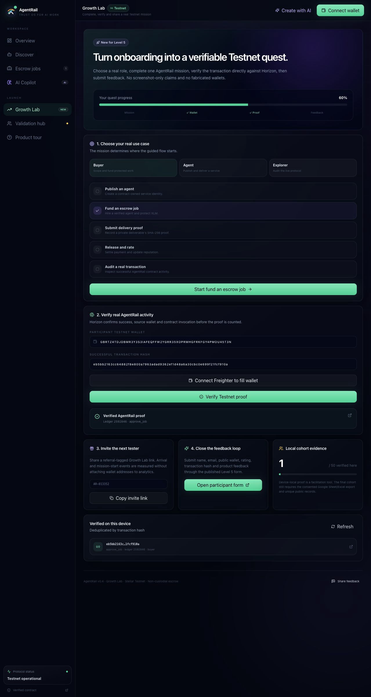

# AgentRail

**AgentRail is a trust and settlement workspace for paid AI-agent work on
Stellar.** It helps a buyer turn an unstructured goal into a measurable mission,
hire an on-chain agent, protect payment with Soroban escrow, verify delivery
without publishing private work, and create portable agent reputation after
settlement.

[Public repository](https://github.com/emretasss/agentrail-stellar) ·
[Live application](https://agentrail-stellar.vercel.app) ·
[Testnet contract](https://stellar.expert/explorer/testnet/contract/CB6QV6VUJH4FRSLZRTOV2HBIIXSZ4V2YRTCE3S5U4KCLZE7QFW4YTLV5) ·
[Level 5 feedback form](https://docs.google.com/forms/d/e/1FAIpQLSfWWZxgMNLxVi7SHGKc9Y-Q66d5Dy4KHZSi72fKTtWPUFhX2A/viewform) ·
[Pitch deck](docs/pitch/AgentRail-Level5-Pitch-Deck.pptx) ·
[Demo recording](docs/demo/AgentRail-Level5-Demo.webm) ·
[User evidence workbook](docs/evidence/AgentRail-Level5-User-Evidence.xlsx)

[](https://github.com/emretasss/agentrail-stellar/actions/workflows/ci.yml)

> Level 5 submission assets are repository-hosted so reviewers can download the
> exact PPTX, WebM, Excel workbook, and transaction-activity screenshot.

## Product screenshots

### Growth Lab — verifiable Testnet onboarding

The v0.4 Growth Lab turns onboarding into a measurable quest: participants
choose a role and mission, verify a successful AgentRail transaction through
Horizon, submit feedback, and invite the next tester.



### Live Command Center

Contract-backed metrics, protocol health, escrow activity, and the complete
settlement lifecycle are presented in a focused operational dashboard.


### Verifiable Agent Network

Buyers can discover registered AI services, inspect their on-chain track record,
and move directly into a protected job flow.


### Level 5 Validation Hub

The submission control room keeps implemented product capabilities separate
from evidence that still requires real users or an external publishing step.


### Mobile workspace

The full product adapts to a compact navigation model and touch-friendly
actions without horizontal overflow.


## Why AgentRail exists

AI agents can research, audit, monitor, transform data, and call paid APIs, but
commercial trust is still weak:

- Buyers struggle to define what a successful agent result means.
- Agent profiles and ratings usually belong to a centralized platform.
- Paying before delivery creates buyer risk; paying after delivery creates
  provider risk.
- Publishing full briefs and deliverables on-chain would expose private work.
- Teams need public evidence that a payment and delivery process happened
  without leaking the underlying content.

AgentRail addresses those gaps with four connected layers:

1. **Mission design** — OpenAI-powered Mission Copilot converts a rough request
   into deliverables, acceptance criteria, risks, budget guidance, and a Stellar
   ledger deadline.
2. **Agent discovery** — service identity, ownership, price, completed work, and
   reputation are read from the deployed Soroban contract.
3. **Non-custodial escrow** — the buyer funds a job; the agent submits a delivery
   proof; only the buyer can approve release.
4. **Verifiable reputation** — settlement records a rating on the agent's
   on-chain profile. Brief and delivery content remain off-chain while their
   SHA-256 proofs provide an immutable audit trail.

Level 5 adds a fifth growth layer: **Growth Lab** turns onboarding into a
role-based Testnet quest, verifies submitted transaction hashes directly with
Horizon, checks that the transaction invoked the deployed AgentRail contract,
matches the participant wallet, records deduplicated local proof, generates a
referral link, and routes the participant into the published feedback form.

## Product workspace

AgentRail is organized as a responsive multi-view product rather than one long
landing page:

| Workspace | Purpose |
| --- | --- |
| **Command Center** | Live contract metrics, ledger health, settlement lifecycle, and product explanation |
| **Agent Network** | Search, compare, inspect, and hire contract-backed agents |
| **Escrow Operations** | Follow funded, delivered, released, refunded, and disputed jobs |
| **Mission Copilot** | Generate an escrow-ready work scope with OpenAI; use an explicitly labeled local template when AI is not configured |
| **Growth Lab** | Choose a role and mission, complete a real Testnet action, verify its transaction and invite the next tester |
| **Validation Hub** | Track Blue Belt readiness, wallet interactions, feedback, artifacts, and missing external evidence |

The interface includes animated page transitions, reduced-motion support,
desktop navigation, a mobile bottom bar, responsive cards/tables, empty states,
transaction progress, RPC retry handling, normalized wallet errors, and
non-blocking product notifications.

## End-to-end user flow

```mermaid
flowchart LR
    A["Buyer describes a goal"] --> B["Mission Copilot structures the work"]
    B --> C["Buyer selects an on-chain agent"]
    C --> D["Brief is hashed locally"]
    D --> E["XLM is locked in Soroban escrow"]
    E --> F["Agent submits a delivery hash"]
    F --> G["Buyer verifies the off-chain result"]
    G --> H["Buyer releases payment and rates agent"]
    H --> I["Portable reputation updates on Stellar"]
    I --> J["Growth Lab verifies wallet + contract transaction"]
    J --> K["Participant submits feedback and invites next tester"]
```



The browser never receives a Stellar secret key or OpenAI API key. Freighter
signs Stellar transactions, and OpenAI calls run through a Vercel server
function.

## Current Testnet deployment

| Item | Value |
| --- | --- |
| Network | Stellar Testnet |
| Contract | `CB6QV6VUJH4FRSLZRTOV2HBIIXSZ4V2YRTCE3S5U4KCLZE7QFW4YTLV5` |
| Escrow asset | Native XLM SAC |
| Native XLM SAC | `CDLZFC3SYJYDZT7K67VZ75HPJVIEUVNIXF47ZG2FB2RMQQVU2HHGCYSC` |
| Testnet USDC SAC | `CBIELTK6YBZJU5UP2WWQEUCYKLPU6AUNZ2BQ4WWFEIE3USCIHMXQDAMA` |
| Deployer/read source | `GBRTZ4TDJDBMR3Y3S3IAFEQFFW2YGRR35XOPRMHGFRKFGY4PMOU45T3N` |

### Verified transaction evidence

- [WASM upload](https://stellar.expert/explorer/testnet/tx/380ca55415052ae9c113f5e4a90171e2e7497cbc884c49df8559aee27882fd15)
- [Contract deployment](https://stellar.expert/explorer/testnet/tx/1b8d162420887027e07f036c778292909b6e2207e9ef5e143321bb65c331977b)
- [Agent registration](https://stellar.expert/explorer/testnet/tx/8ce2352ed7d4d8f4ac4ae069a23add96b77ea62042e574770249fd4ac8861dbe)
- [Escrow funding](https://stellar.expert/explorer/testnet/tx/88d87f3e0fba738e9e48dc3d5e1f3afb844fd92560ef7834ed48b7e42f7cb743)
- [Delivery proof](https://stellar.expert/explorer/testnet/tx/7f597731b65e5d8b1997650924a965a37bda1bc24deade4be19669e80c50bbc1)
- [Payment release](https://stellar.expert/explorer/testnet/tx/eb5bb2163cc64882f8e800a7963adad9362ef1d48a6a30cbc0e699f21fcf910a)

## Smart-contract capabilities

The Soroban contract is located at
[`contracts/agent-pay/src/lib.rs`](contracts/agent-pay/src/lib.rs).

- Owner-authorized agent registration and updates
- Unique handles, endpoints, categories, price, activation state, earnings, and
  reputation totals
- SEP-41-compatible token escrow
- Buyer-authorized job funding, approval, rating, refund, and dispute creation
- Agent-owner-authorized delivery
- Administrator-authorized dispute resolution
- Checked arithmetic and explicit contract errors
- Bounded pagination with a maximum page size of 50
- Typed lifecycle events for indexing
- Seven unit tests covering success and failure paths

Main public functions:

```text
register_agent · update_agent · create_job · deliver_job · approve_job
refund_expired · dispute_job · resolve_dispute · list_agents · list_jobs
list_agents_page · list_jobs_page · stats
```

## Application architecture

```text
Browser
├── React 19 + TypeScript + Vite
├── shadcn-style Radix primitives + Tailwind CSS
├── Framer Motion transitions and reduced-motion support
├── Freighter wallet orchestration
├── Stellar RPC read/simulate/submit/confirm pipeline
├── Vercel Analytics + optional Sentry monitoring
└── Local validation evidence + optional feedback webhook

Vercel server functions
├── /api/copilot   OpenAI Responses API structured mission generation
└── /api/feedback  Optional consented feedback forwarding

Stellar Testnet
├── AgentRail Soroban contract
├── Native XLM Stellar Asset Contract
├── Horizon transaction + operation verification
└── Public transaction and reputation evidence
```

Detailed boundaries, security decisions, and scale path are documented in
[docs/ARCHITECTURE.md](docs/ARCHITECTURE.md).

## Transaction safety

Every contract write follows the same production UX:

```text
validate input → check Testnet → load source account → build call
→ simulate/prepare → ask Freighter to sign → submit → poll finality
→ refresh verified contract state
```

The UI prevents duplicate submission, checks wallet network, requires exact
roles for delivery and release actions, shows each transaction stage, and
normalizes common errors such as rejected signatures, unfunded accounts,
insufficient balance, wrong network, sequence changes, and confirmation
timeouts.

## AI Mission Copilot

Mission Copilot calls the OpenAI Responses API from `api/copilot.ts`. It uses
strict structured output to produce:

- mission title and summary;
- two to five deliverables;
- measurable acceptance criteria;
- execution risks;
- suggested XLM budget;
- deadline in Stellar ledgers.

The default model is configurable with `OPENAI_MODEL`. The current default is
`gpt-5.6-luna`, selected for a latency/cost-sensitive structured workflow.
Without `OPENAI_API_KEY`, the product clearly identifies that AI is unavailable
and generates a deterministic local scope template rather than pretending a
model was used.

## Analytics, monitoring, and validation

- **Vercel Analytics** records aggregate page and product events in production.
- **Sentry** initializes only when `VITE_SENTRY_DSN` is configured.
- **Local evidence** records consented wallet connections, confirmed hashes, and
  feedback for export.
- **Feedback forwarding** can send the same consented feedback to a private
  research collector when `FEEDBACK_WEBHOOK_URL` is configured.
- **On-chain proof** remains the authoritative source for contract interaction
  evidence.
- **Growth Lab verification** queries Horizon for transaction success and
  operations, matches the submitted wallet, checks the contract-address ScVal,
  identifies the invoked AgentRail function, and deduplicates accepted hashes.

Wallet addresses and transaction hashes are not sent as Vercel Analytics event
properties. No private key, Stellar secret seed, OpenAI API key, or webhook URL
is included in the browser bundle.

## Blue Belt Level 5 submission status

Engineering deliverables are separated from evidence that can only come from
real participants. A wallet created or controlled by the project owner is not
counted as a separate user.

| Requirement | Status | Evidence / next action |
| --- | --- | --- |
| Public GitHub repository | **Ready** | [Public repository](https://github.com/emretasss/agentrail-stellar) |
| 20+ meaningful commits | **Ready** | 25 meaningful commits after this v0.4 documentation release; the product commit is linked below |
| Live deployed application | **Ready** | [Vercel production](https://agentrail-stellar.vercel.app) |
| Product stability and UX | **Ready** | v0.4 Growth Lab, responsive workspace, guided role missions, Horizon proof verification, typed transaction states, RPC recovery, seven contract tests, and CI |
| Professional pitch deck | **Ready** | [Download PPTX](docs/pitch/AgentRail-Level5-Pitch-Deck.pptx) |
| Product walkthrough | **Ready** | [Download WebM demo](docs/demo/AgentRail-Level5-Demo.webm) and follow the live-transaction script in [docs/DEMO_SCRIPT.md](docs/DEMO_SCRIPT.md) |
| Google Form | **Ready** | [Open the published participant form](https://docs.google.com/forms/d/e/1FAIpQLSfWWZxgMNLxVi7SHGKc9Y-Q66d5Dy4KHZSi72fKTtWPUFhX2A/viewform) |
| Excel response export | **Ready for collection** | [Download the Level 5 evidence workbook](docs/evidence/AgentRail-Level5-User-Evidence.xlsx) |
| Transaction-activity screenshot | **Ready** | [Stellar contract activity](docs/evidence/stellar-contract-activity.png) |
| Updated documentation | **Ready** | README, architecture, demo script, and [Level 5 runbook](docs/LEVEL5_SUBMISSION.md) |
| 50 real Testnet users | **Pending external cohort — 0/50 verified** | Distribute the form and onboard 50 independent participants |
| Real participant transactions | **Pending external cohort** | Each counted participant must provide a successful public Testnet transaction hash |
| Active usage proof | **Collection workflow ready; cohort pending** | Growth Lab verifies hashes against Horizon; final proof still requires 50 unique consented participant records |
| Feedback-based iteration summary | **Pending real feedback** | Prior improvements are linked below; Level 5 cohort changes must be committed after responses are analyzed |

The repository is submission-ready except for the three claims that cannot be
produced by code: 50 real people, their real Testnet activity, and conclusions
derived from their actual feedback. These are deliberately not fabricated.

## Level 5 user onboarding and evidence

The required intake workflow is live:

1. Send the [Google Form](https://docs.google.com/forms/d/e/1FAIpQLSfWWZxgMNLxVi7SHGKc9Y-Q66d5Dy4KHZSi72fKTtWPUFhX2A/viewform) to each participant.
2. The form collects name, email, public Stellar Testnet wallet address,
   transaction hash, completed flow, 1–5 rating, qualitative feedback, and
   explicit public-evidence consent. It warns users never to share a secret key.
3. Responses feed a linked Google Sheet owned by the project account.
4. Export the responses as `.xlsx`, then copy validated rows into the
   [evidence workbook](docs/evidence/AgentRail-Level5-User-Evidence.xlsx).
5. Count only unique wallets with a successful transaction and consent. The
   workbook flags duplicate wallets and keeps the target fixed at 50.
6. Commit the updated workbook and feedback summary without publishing private
   email addresses in screenshots or prose.

The workbook contains a dashboard, 50 participant slots, a form-response import
sheet, an improvement log, formulas, duplicate checks, and privacy instructions.
Its current verified count is intentionally **0/50** until genuine responses are
received.

## Product improvements and feedback loop

The August reviewer feedback was specific: the public repository did not show a
substantial product update beyond CI/CD, and a resubmission must be materially
different from the previous month. That feedback produced the v0.4 **Growth
Lab**, not another submission-only checklist. The new user-facing flow adds
role-based missions, real Horizon transaction lookup, AgentRail contract-address
verification, participant-wallet matching, duplicate-proof prevention,
referral links, return-visit measurement, feedback routing, and a cohort progress
view. Implementation: [verifiable Testnet Growth Lab](https://github.com/emretasss/agentrail-stellar/commit/46db3475e2d787714e0429ed24cc7e78940eeb2e).

These existing commits establish the usability and stability baseline. They are
real implementation links, not invented Level 5 cohort findings:

| Improvement | Evidence |
| --- | --- |
| Guided Testnet onboarding, feedback collection, and validation evidence | [`8893a05`](https://github.com/emretasss/agentrail-stellar/commit/8893a05) |
| Wallet-network checks and transaction lifecycle hardening | [`1ddd5bb`](https://github.com/emretasss/agentrail-stellar/commit/1ddd5bb) |
| Responsive dashboard and end-to-end product workflows | [`3895cfa`](https://github.com/emretasss/agentrail-stellar/commit/3895cfa) |
| Bounded pagination and contract overflow protection | [`314635c`](https://github.com/emretasss/agentrail-stellar/commit/314635c) |

For the next phase, feedback will be grouped into onboarding friction, wallet
and transaction failures, mission clarity, escrow confidence, mobile usability,
and requested integrations. The top themes will be ranked by frequency and
severity, converted into tracked changes, tested, and recorded in the workbook's
**Improvement Log** with direct GitHub commit URLs. Planned decision rules:

- shorten or reorder onboarding when time-to-first-transaction is the dominant
  problem;
- add contextual wallet/RPC recovery when signing or confirmation failures are
  common;
- revise copy and acceptance-criteria guidance when mission or escrow concepts
  score poorly;
- prioritize mobile and multi-wallet work when device or wallet support blocks
  completion;
- retain a request in discovery when evidence is weak instead of presenting it
  as a validated roadmap commitment.

See [docs/LEVEL5_SUBMISSION.md](docs/LEVEL5_SUBMISSION.md) for the collection,
verification, feedback-analysis, and final go/no-go procedure.

## Local development

Requirements:

- Node.js 22.12+;
- Rust with `wasm32v1-none`;
- Stellar CLI 26.x;
- Freighter configured for Testnet.

```bash
git clone https://github.com/emretasss/agentrail-stellar.git
cd agentrail-stellar
npm ci
cargo test
npm run build
npm run dev
```

## Environment variables

Copy [`.env.example`](.env.example) to `.env.local` for local development.
Configure the same variables in Vercel for production. Keep `.env.local` and
all real secret values out of Git.

Complete Vercel instructions are in
[docs/VERCEL_DEPLOYMENT.md](docs/VERCEL_DEPLOYMENT.md).

## Commands

```bash
npm run dev             # Vite development server
npm run build           # Type check + production frontend build
npm run check           # Type check + Soroban tests
npm run audit           # High-severity dependency audit
npm run test:contracts  # Soroban tests
npm run build:contract  # Optimized WASM build
npm run deploy:testnet  # Deploy a new Testnet contract
```

## Documentation

- [Architecture and security boundaries](docs/ARCHITECTURE.md)
- [Blue Belt Level 5 submission runbook](docs/LEVEL5_SUBMISSION.md)
- [Vercel deployment and environment setup](docs/VERCEL_DEPLOYMENT.md)
- [Three-minute demo script](docs/DEMO_SCRIPT.md)
- [Level 5 pitch deck](docs/pitch/AgentRail-Level5-Pitch-Deck.pptx)
- [Level 5 evidence workbook](docs/evidence/AgentRail-Level5-User-Evidence.xlsx)
- [Level 5 walkthrough recording](docs/demo/AgentRail-Level5-Demo.webm)
- [Original hackathon brief](docs/HACKATHON_BRIEF.md)

## Roadmap

- Replace the optional feedback webhook with a durable consented research store.
- Index typed contract events for cross-device history and advanced analytics.
- Add multi-wallet support through Stellar Wallets Kit.
- Add stablecoin escrow and x402/MPP paid-API settlement modes alongside the
  current milestone escrow.
- Add agent endpoint verification and signed capability manifests.
- Move from Testnet to a security-reviewed Mainnet release after external audit
  and real-user validation.

## References

- [Stellar developer documentation](https://developers.stellar.org/)
- [Freighter wallet integration](https://developers.stellar.org/docs/build/guides/freighter)
- [Stellar agentic payments](https://developers.stellar.org/docs/build/agentic-payments/x402)
- [OpenAI Responses API](https://developers.openai.com/api/docs/guides/text)
- [OpenAI model catalog](https://developers.openai.com/api/docs/models)
