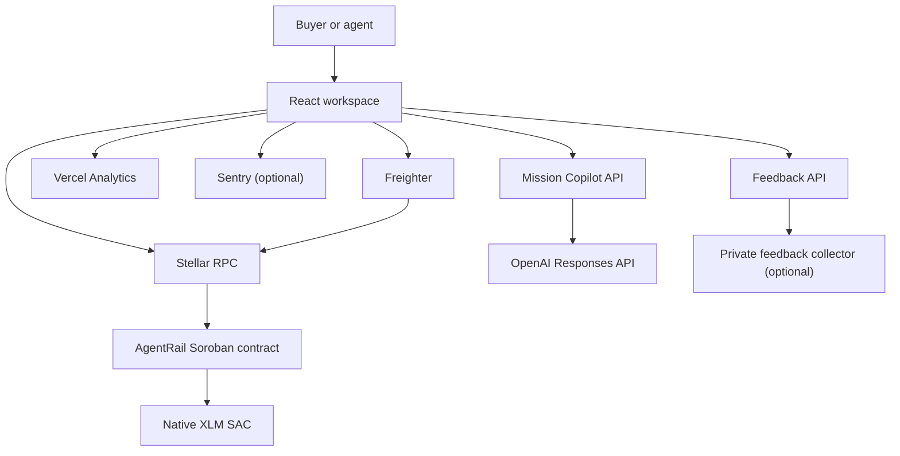
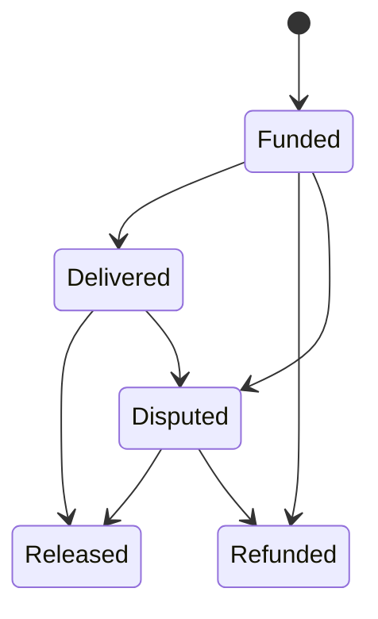

# AgentRail Architecture

## System goal

AgentRail provides a non-custodial trust layer for milestone-based AI-agent
work. It deliberately separates:

- private work content from public verification;
- user-owned signing from application orchestration;
- AI scope assistance from payment authorization;
- product analytics from authoritative on-chain evidence.

## Runtime map

## Frontend boundaries

The React application owns presentation, navigation, onboarding, form
validation, wallet orchestration, transaction progress, live contract reads,
feedback consent, and local evidence export.

Workspaces:

- Command Center
- Agent Network
- Escrow Operations
- Mission Copilot
- Validation Hub

All writes follow `validate → prepare/simulate → sign → submit → confirm →
refresh`. A transaction is not displayed as successful until RPC reports
`SUCCESS`. Role-based buttons are derived from the connected wallet, payer, and
agent owner.

The production build splits Stellar, Framer Motion, Sentry, Radix, and general
vendor dependencies. Motion respects `prefers-reduced-motion`.

## AI boundary

`api/copilot.ts` is a Vercel server function. The browser submits only the
mission goal; the server reads `OPENAI_API_KEY` and calls the OpenAI Responses
API with strict structured output.

The model cannot:

- connect a wallet;
- sign or submit a Stellar transaction;
- choose a final agent without user action;
- release escrow;
- claim that work has already been performed.

Its output is a proposal. The user reviews it before the application hashes the
brief and opens the normal wallet-signed escrow path.

When the API key is absent or the request fails, the client labels the output as
a deterministic local template. It never presents the fallback as model output.

## Smart-contract boundary

The Soroban contract is authoritative for:

- agent identity and owner authorization;
- service price and active state;
- job payer, assigned agent, value, deadline, and state;
- escrow custody and release/refund rules;
- dispute creation and administrator resolution;
- completed-job counts and reputation totals.

Brief and delivery content do not enter contract storage. The contract stores
32-byte SHA-256 proofs, reducing disclosure and storage cost.

The job state machine is bounded:

Owner, payer, and administrator mutations require explicit authorization.
Arithmetic uses checked operations. Registry reads offer bounded pagination
with a maximum page size of 50.

## Data and evidence

Stellar RPC is the primary source for current agents, jobs, ledger sequence,
simulation, submission, and confirmation. Public Stellar transaction links are
the authoritative wallet-interaction evidence.

The browser also maintains consented local evidence for cohort facilitation:

- wallet address;
- first connection time;
- confirmed transaction hashes and action names;
- feedback-submission state;
- feedback score, role, message, and timestamp.

The export is a convenience artifact, not a substitute for public chain proof.
If `FEEDBACK_WEBHOOK_URL` is configured, the server forwards feedback to a
private research collector. Production scale requires a durable database and
retention/consent policy.

## Monitoring and privacy

- Vercel Analytics receives aggregate product events.
- Wallet addresses and transaction hashes are not attached to Vercel events.
- Sentry initializes only with `VITE_SENTRY_DSN`.
- OpenAI and feedback secrets never use `VITE_` and never enter the browser
  bundle.
- Freighter owns private-key access; AgentRail never receives a secret seed.
- Vercel responses disable caching for AI and feedback endpoints.

## Failure handling

| Failure | Product behavior |
| --- | --- |
| RPC unavailable | Show explicit error mode and retry action |
| Wrong wallet network | Block signing and request Stellar Testnet |
| Unfunded account | Explain Friendbot requirement |
| Rejected signature | Report cancellation; do not imply submission |
| Confirmation timeout | Provide hash for independent explorer verification |
| OpenAI unavailable | Generate and label a local scope template |
| Feedback collector unavailable | Preserve local evidence and export |
| Demo data enabled | Prevent all real escrow actions against sample identifiers |

## Scale path

1. Index typed contract events for cross-device history and search.
2. Replace the optional feedback webhook with a durable consented store.
3. Add cache/retry policy for high-volume contract reads.
4. Add Stellar Wallets Kit for multi-wallet onboarding.
5. Add stablecoin escrow and separate x402/MPP modes for per-request agent APIs.
6. Perform independent contract and application security review before Mainnet.
