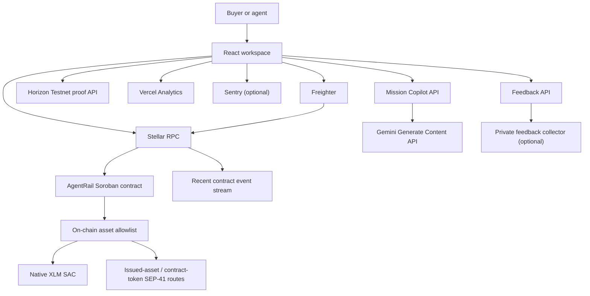
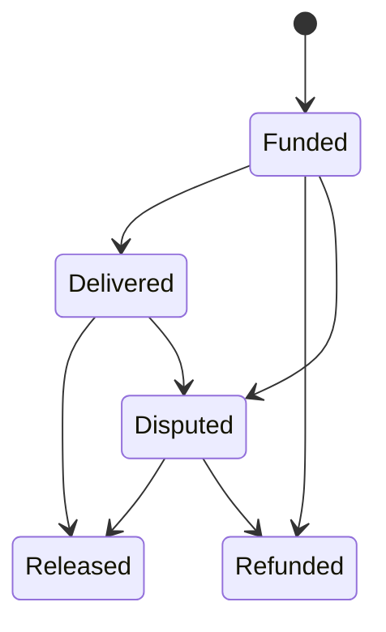
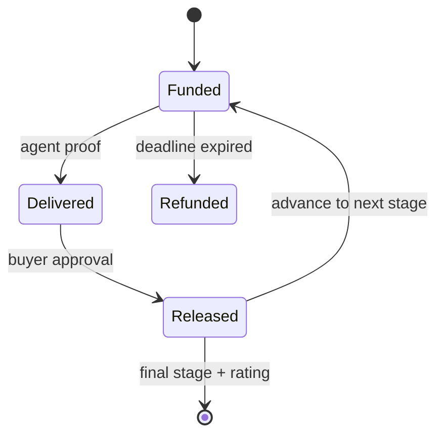

# AgentRail Architecture

## System goal

AgentRail provides a non-custodial trust layer for milestone-based AI-agent
work. It deliberately separates:

- private work content from public verification;
- user-owned signing from application orchestration;
- AI scope assistance from payment authorization;
- product analytics from authoritative on-chain evidence.

## Runtime map

## Frontend boundaries

The React application owns presentation, navigation, onboarding, form
validation, wallet orchestration, transaction progress, live contract reads,
feedback consent, and local evidence export.

Workspaces:

- Command Center
- Agent Network
- Escrow Operations
- Milestone Escrow
- Treasury Console
- Reputation Lab
- Mission Playbooks
- Mission Copilot
- Network Explorer
- Growth Lab
- Validation Hub

All writes follow `validate → prepare/simulate → sign → submit → confirm →
refresh`. A transaction is not displayed as successful until RPC reports
`SUCCESS`. Role-based buttons are derived from the connected wallet, payer, and
agent owner.

Growth Lab is a read-only verification and onboarding boundary. It looks up a
submitted hash on Horizon Testnet, requires a successful transaction, inspects
the transaction operations, compares the first invoke-contract parameter with
the deployed AgentRail contract-address ScVal, matches the submitted participant
wallet with the transaction/operation source, and stores only deduplicated proof
on the current device. It never signs or submits a transaction on the user's
behalf.

The production build splits Stellar, Framer Motion, Sentry, Radix, and general
vendor dependencies. Motion respects `prefers-reduced-motion`.

## AI boundary

`api/copilot.ts` is a Vercel server function. The browser submits only the
mission goal; the server reads `GEMINI_API_KEY` and calls the Gemini Generate
Content API with strict structured output.

The model cannot:

- connect a wallet;
- sign or submit a Stellar transaction;
- choose a final agent without user action;
- release escrow;
- claim that work has already been performed.

Its output is a proposal. The user reviews it before the application hashes the
brief and opens the normal wallet-signed escrow path.

When the API key is absent or the request fails, the client labels the output as
a deterministic local template. It never presents the fallback as model output.

## Smart-contract boundary

The Soroban contract is authoritative for:

- agent identity and owner authorization;
- service price and active state;
- job payer, assigned agent, value, deadline, and state;
- escrow custody and release/refund rules;
- dispute creation and administrator resolution;
- completed-job counts and reputation totals.
- the enabled settlement-asset registry and each job's immutable token route;
- funding pause state and timelocked upgrade proposal state.

Brief and delivery content do not enter contract storage. The contract stores
32-byte SHA-256 proofs, reducing disclosure and storage cost.

The job state machine is bounded:

Complex missions use a second bounded state machine. A plan contains 2–8
milestones, each with its own brief proof, amount, delivery proof, deadline, and
status. `current_index` prevents later work from bypassing earlier acceptance.
Only the current delivered milestone can release funds. The last approval
closes the parent job and updates reputation once.

The contract records `released_amount` and computes expiry refunds as
`job.amount - released_amount`. Refund is rejected after the current delivery
proof is recorded, preventing a buyer from receiving the work and reclaiming
the same escrow slice. Legacy settlement entrypoints reject milestone jobs so a
plan cannot be paid twice through the single-delivery path.

Owner, payer, and administrator mutations require explicit authorization.
Arithmetic uses checked operations. Registry reads offer bounded pagination
with a maximum page size of 50.

### Multi-asset settlement boundary

AgentRail depends only on the SEP-41 transfer interface. Native XLM, issued
Stellar assets exposed through their Stellar Asset Contract, and compatible
contract tokens can therefore use the same escrow state machine. An asset must
first be registered by the protocol administrator; jobs persist the selected
token address and all release, dispute, and refund paths resolve that immutable
route instead of a mutable global default. Legacy jobs fall back to the original
XLM token key.

The browser currently enables seven-decimal routes, matching Stellar asset
precision. The contract records metadata for up to 18 decimals so later clients
can support other SEP-41 implementations without a storage migration.

### Protocol safety plane

The circuit breaker blocks only new funding. Existing obligations retain their
delivery, approval, dispute resolution, and refund exits so an emergency action
cannot strand user funds. Contract upgrades require administrator authorization,
an uploaded WASM hash, and a minimum 17,280-ledger delay. The proposal is public
contract state, can be cancelled before execution, and is exposed in Network
Explorer for reviewer visibility.

### Event data plane

Network Explorer calls Stellar RPC `getEvents` with a contract-address filter
over a recent ledger window. It decodes event topics and values, deduplicates by
RPC event identifier, and links every displayed transition to its transaction.
This is an operational view, not permanent indexing: RPC history is bounded, so
production analytics still require durable ingestion.

## Data and evidence

Stellar RPC is the primary source for current agents, jobs, ledger sequence,
simulation, submission, and confirmation. Public Stellar transaction links are
the authoritative wallet-interaction evidence.

The browser also maintains consented local evidence for cohort facilitation:

- wallet address;
- first connection time;
- confirmed transaction hashes and action names;
- feedback-submission state;
- feedback score, role, message, and timestamp.

The export is a convenience artifact, not a substitute for public chain proof.
If `FEEDBACK_WEBHOOK_URL` is configured, the server forwards feedback to a
private research collector. Production scale requires a durable database and
retention/consent policy.

For external cohort validation, a published Google Form collects the participant
name, email, public Testnet wallet, successful transaction hash, product rating,
qualitative feedback, and explicit evidence consent. Responses flow to a linked
Google Sheet and are exported into the repository's Excel evidence workbook for
duplicate checks and aggregate analysis. Email addresses remain operational
records and must not appear in public screenshots or narrative summaries.

## Monitoring and privacy

- Vercel Analytics receives aggregate product events.
- Wallet addresses and transaction hashes are not attached to Vercel events.
- Sentry initializes only with `VITE_SENTRY_DSN`.
- Gemini and feedback secrets never use `VITE_` and never enter the browser
  bundle.
- Freighter owns private-key access; AgentRail never receives a secret seed.
- Vercel responses disable caching for AI and feedback endpoints.

## Failure handling

| Failure | Product behavior |
| --- | --- |
| RPC unavailable | Show explicit error mode and retry action |
| Wrong wallet network | Block signing and request Stellar Testnet |
| Unfunded account | Explain Friendbot requirement |
| Rejected signature | Report cancellation; do not imply submission |
| Confirmation timeout | Provide hash for independent explorer verification |
| Gemini unavailable | Generate and label a local scope template |
| Feedback collector unavailable | Preserve local evidence and export |
| Demo data enabled | Prevent all real escrow actions against sample identifiers |
| New ABI method absent on an older deployment | Fall back to legacy jobs/XLM metadata and label unavailable live state |
| Funding circuit breaker active | Reject new deposits while preserving settlement and refund exits |
| Event outside RPC retention | Keep current state available and show an empty recent-event window |

## Scale path

1. Deploy v0.6 to Testnet, register the XLM and testnet USDC SAC routes, run public lifecycles, and update the production contract ID.
2. Persist the implemented RPC event stream for cross-device history and search.
3. Replace the optional feedback webhook with a durable consented store.
4. Add cache/retry policy for high-volume contract reads.
5. Add Stellar Wallets Kit for multi-wallet onboarding.
6. Add separate x402/MPP modes for per-request agent APIs.
7. Perform independent contract and application security review before Mainnet.
